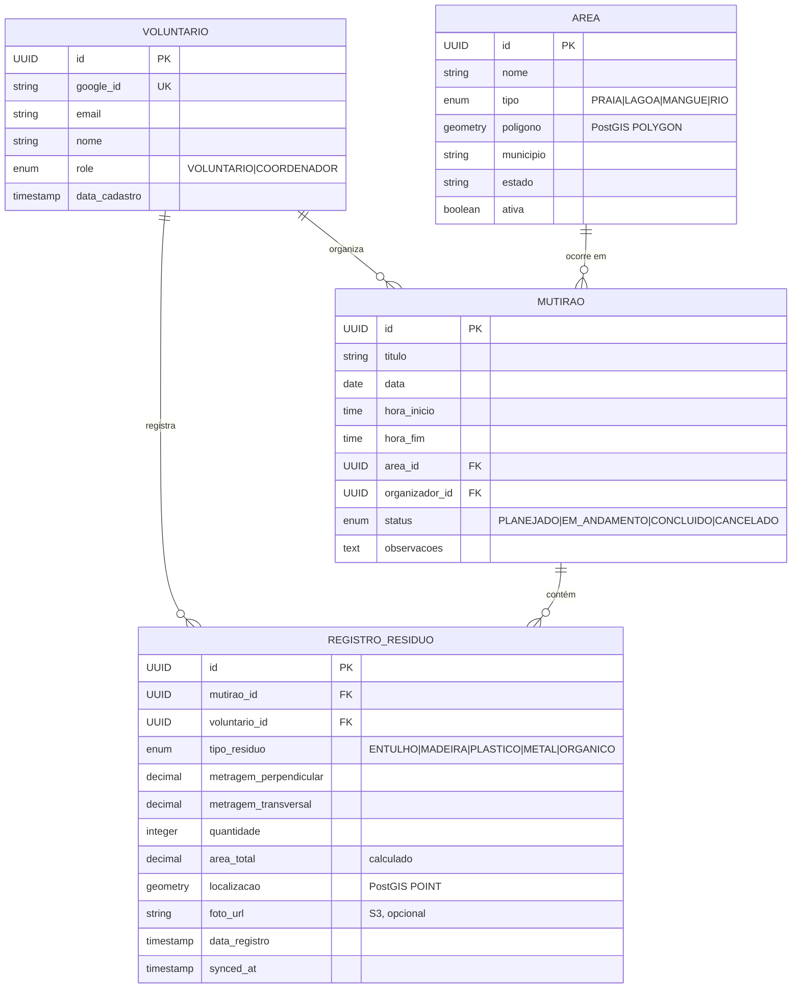

# Modelo de Domínio — Mar Sem Lixo

Modelo de domínio do MVP, construído sobre o esboço inicial de data model
proposto pelo idealizador e refinado para suportar os requisitos de
multi-usuário, geolocalização e operação offline-first.

> **Status:** modelo inicial. Campos relacionados à mensuração de resíduo
> (`metragemPerpendicular`, `metragemTransversal`, `areaTotal`, lista de
> `tipoResiduo`) estão marcados como hipótese de trabalho e devem ser
> revistos quando o relatório oficial da ONG estiver disponível.

## Diagrama de entidades



## Entidades

### Voluntario

Pessoa autenticada que pode registrar resíduos em campo e, dependendo do
papel, organizar mutirões.

| Campo         | Tipo      | Restrições                                       |
|---------------|-----------|--------------------------------------------------|
| id            | UUID      | PK, gerado pelo backend                          |
| googleId      | String    | Único, vem do Google ID Token (claim `sub`)      |
| email         | String    | Único, vem do Google ID Token                    |
| nome          | String    | Não-nulo, vem do Google ID Token                 |
| role          | Enum      | VOLUNTARIO (default) ou COORDENADOR              |
| dataCadastro  | Timestamp | Auto-preenchido no primeiro login bem-sucedido   |

**Invariantes:**
- `googleId` é imutável após o cadastro
- `email` pode ser atualizado se o valor mudar no Google (em login subsequente)
- Promoção de VOLUNTARIO para COORDENADOR só pode ser feita por outro
  COORDENADOR (no MVP, executar via comando administrativo direto no banco
  até existir UI de gestão de papéis)

### Area

Região geográfica delimitada por polígono onde mutirões acontecem.

| Campo     | Tipo            | Restrições                                  |
|-----------|-----------------|---------------------------------------------|
| id        | UUID            | PK                                          |
| nome      | String          | Não-nulo, único por município               |
| tipo      | Enum            | PRAIA, LAGOA, MANGUE, RIO                   |
| poligono  | PostGIS Polygon | Não-nulo, SRID 4326 (WGS84)                 |
| municipio | String          | Não-nulo                                    |
| estado    | String          | Não-nulo, sigla UF (2 caracteres)           |
| ativa     | Boolean         | Default `true`; soft-delete via `false`     |

**Invariantes:**
- Polígono deve ser válido topologicamente (sem self-intersection)
- Áreas com mutirões associados não podem ser hard-deleted, apenas
  inativadas
- Operação de busca espacial: dado um ponto (lat, lng) de um registro de
  resíduo, deve ser possível identificar a Área que o contém via
  `ST_Contains`

### Mutirao

Evento de coleta com tempo, lugar e participantes definidos.

| Campo          | Tipo    | Restrições                                            |
|----------------|---------|-------------------------------------------------------|
| id             | UUID    | PK                                                    |
| titulo         | String  | Não-nulo                                              |
| data           | Date    | Não-nulo; futura ou de hoje na criação                |
| horaInicio     | Time    | Não-nulo                                              |
| horaFim        | Time    | Não-nulo, deve ser maior que `horaInicio`             |
| areaId         | UUID FK | Referencia Area; área deve estar `ativa`              |
| organizadorId  | UUID FK | Referencia Voluntario com role COORDENADOR            |
| status         | Enum    | PLANEJADO, EM_ANDAMENTO, CONCLUIDO, CANCELADO         |
| observacoes    | Text    | Opcional                                              |

**Máquina de estados:**

```
PLANEJADO ──► EM_ANDAMENTO ──► CONCLUIDO
    │              │
    └──────────────┴────► CANCELADO
```

- `PLANEJADO` → `EM_ANDAMENTO`: coordenador inicia o mutirão no app
- `PLANEJADO` → `CANCELADO`: coordenador cancela antes de iniciar
- `EM_ANDAMENTO` → `CONCLUIDO`: coordenador encerra após a coleta
- `EM_ANDAMENTO` → `CANCELADO`: coordenador cancela durante (raro)
- `CONCLUIDO` e `CANCELADO` são estados terminais

**Invariantes:**
- Não é possível transicionar de CONCLUIDO ou CANCELADO para outros estados
- Registros de resíduo só podem ser criados em mutirões com status
  `EM_ANDAMENTO`
- Mutirão `CONCLUIDO` não permite criação, edição ou remoção de seus
  registros

### RegistroResiduo

Unidade de dado capturada em campo durante um mutirão.

| Campo                  | Tipo            | Restrições                                |
|------------------------|-----------------|-------------------------------------------|
| id                     | UUID            | PK; gerado no cliente para idempotência   |
| mutiraoId              | UUID FK         | Não-nulo; mutirão deve estar EM_ANDAMENTO |
| voluntarioId           | UUID FK         | Não-nulo                                  |
| tipoResiduo            | Enum            | ENTULHO, MADEIRA, PLASTICO, METAL, ORGANICO ⚠ |
| metragemPerpendicular  | Decimal(8,2)    | > 0, em metros ⚠                          |
| metragemTransversal    | Decimal(8,2)    | > 0, em metros ⚠                          |
| quantidade             | Integer         | > 0                                       |
| areaTotal              | Decimal(10,2)   | Calculado: `perp × trans × qtd` ⚠         |
| localizacao            | PostGIS Point   | SRID 4326, capturado do device            |
| fotoUrl                | String          | URL de objeto no S3, opcional             |
| dataRegistro           | Timestamp       | Não-nulo, momento do registro local       |
| syncedAt               | Timestamp       | Setado pelo servidor ao receber           |

⚠ Campos sujeitos a revisão conforme metodologia oficial da ONG.

**Invariantes:**
- `areaTotal` é sempre derivada, nunca aceita como entrada do cliente
- `id` é gerado no cliente (UUID v4) para garantir idempotência: se o sync
  reenviar o mesmo registro, o servidor detecta e ignora a duplicata
- `dataRegistro` é fornecida pelo cliente (refletindo o momento real da
  coleta, mesmo offline); `syncedAt` é gerada no servidor
- Localização é obrigatória: se o dispositivo recusar permissão, o
  registro não pode ser criado (UX bloqueia)

## Regras de negócio

1. **Autorização básica.** Voluntário (role VOLUNTARIO) só pode criar
   registros de resíduo em mutirões EM_ANDAMENTO. Coordenador (role
   COORDENADOR) pode criar e gerenciar mutirões e áreas, além de tudo que
   um voluntário pode fazer.

2. **Geolocalização obrigatória.** Todo registro deve ter `localizacao`.
   Se a Geolocation API recusar permissão ou falhar, o registro não pode
   ser criado. UI deve apresentar mensagem clara.

3. **Sincronização tolerante.** Registros offline são armazenados no
   IndexedDB e enviados em lote ao reconectar. Identidade por UUID
   gerado no cliente garante idempotência.

4. **Cálculo de área total.** Sempre = `metragemPerpendicular ×
   metragemTransversal × quantidade`. Implementado como coluna calculada
   no Postgres (`GENERATED ALWAYS AS (...) STORED`) ou no service —
   decisão a documentar em ADR.

5. **Soft delete restrito.** Apenas `Area` admite soft-delete (campo
   `ativa`). Demais entidades não admitem deleção no MVP. Erros em
   registros são corrigidos via edição enquanto o mutirão está
   EM_ANDAMENTO; após CONCLUIDO, ficam imutáveis.

6. **Fuso horário.** Todos os timestamps são armazenados em UTC. UI
   apresenta no fuso local do usuário (assume America/Sao_Paulo no MVP).

## Decisões pendentes

- **Edição de registros após sincronização.** Permitir até CONCLUIDO,
  bloquear depois. ADR a escrever.

- **Múltiplos coordenadores por mutirão.** Modelo atual permite apenas
  um organizador. Se a ONG operar com co-organizadores, virar relação
  N:N (`mutirao_organizadores`).

- **Categoria de tipo de resíduo.** Enum vs tabela. Enum é mais simples
  e adequado ao MVP; virar tabela quando confirmar a taxonomia real da
  ONG (provavelmente 15+ categorias com hierarquia, ex: Plástico → PET,
  PEAD, Filme).

- **Histórico de alterações.** Auditoria via Hibernate Envers ou similar.
  Fora de escopo do MVP, mas vale ADR antecipado se for incluir cedo
  (relatórios para MPF podem exigir trilha de auditoria).

- **Foto: storage e ciclo de vida.** Upload direto ao S3 via URL
  pré-assinada (recomendado) vs upload via backend. Lifecycle policy do
  bucket para arquivar fotos antigas.
